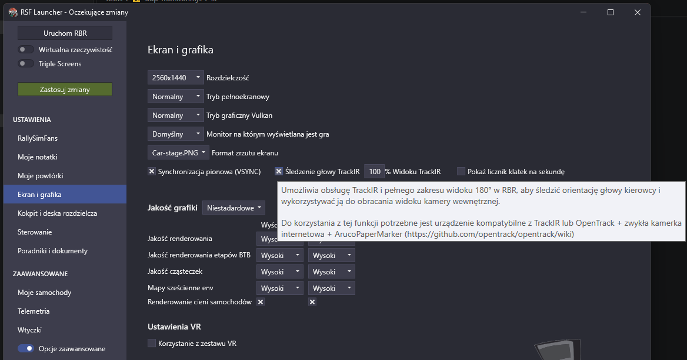

# CapCam

Head tracking for PC racing games using an Android phone on your cap or helmet.
The phone measures where you look and sends it over Wi-Fi to your PC. Games that support
TrackIR pick it up through [opentrack](https://github.com/opentrack/opentrack). No camera, no IR LEDs.

```
phone on your head ──Wi-Fi (UDP)──► opentrack on the PC ──TrackIR protocol──► the game
```

The phone only tracks **rotation** (look left/right, up/down, tilt). It can't measure leaning
(moving your head sideways or forwards).

## Quick start

What has to be in place before you drive:

1. **Phone:** CapCam installed and sending to your PC (output *opentrack*, port `4242`).
2. **PC:** opentrack running with input *UDP over network* and output *freetrack 2.0 Enhanced*.
3. **Game:** its TrackIR option switched on (see [game notes](#game-notes)).
4. **Order:** phone first, then opentrack, then the game.

## Games

| Game | Status | What to switch on |
|---|---|---|
| BeamNG.drive | **Works** | Nothing: TrackIR support is built in |
| Richard Burns Rally (RallySimFans) | **Works** | RSF launcher › *Screen & Graphics* › **TrackIR head tracking** |
| Euro Truck Simulator 2 | Should work (official TrackIR support), not tested yet | `g_trackir` in `config.cfg` |
| Assetto Corsa | Should work, not tested yet | |
| ACC / AC EVO / AC Rally | Not tested yet | |

Any game that supports TrackIR should work the same way.

## What you need

- An Android phone (Android 8.0 or newer) **with a gyroscope**.
- A Windows PC on the **same Wi-Fi / home network** as the phone.
- [opentrack](https://github.com/opentrack/opentrack/releases/latest) 2026.1.0 or newer (free, open source).
- Something to fix the phone to your head: a cap with a stiff brim, a helmet or a headband.
  Velcro works. The phone must not wobble.

## 1. Install the phone app

1. On the phone, download **[CapCam.apk](https://github.com/SkorczanFFF/capcam/releases/latest/download/CapCam.apk)**
   (always the newest version). The [release page](https://github.com/SkorczanFFF/capcam/releases/latest)
   lists what changed and the file's SHA-256 checksum.
2. Open it. Android asks to allow installing apps from your browser or file manager: allow it.
   Chrome may warn that the file type can harm your device; that's shown for every APK from
   outside the Play Store.
3. Google Play Protect may say it doesn't recognise the app: tap **More details › Install anyway**.
4. Xiaomi / HyperOS: in *Settings › Apps › CapCam › Battery* choose **No restrictions**,
   otherwise the system may stop the app during long sessions.

## 2. Set up opentrack on the PC

1. From opentrack's [latest release](https://github.com/opentrack/opentrack/releases/latest) download
   either `opentrack-…-win32-setup.exe` (installer) or `opentrack-…-win32-portable.7z` (unpack it anywhere,
   e.g. with 7-Zip). Skip the `dbginfo` file: it's only for debugging opentrack itself.
2. In the main window:
   - **Input:** `UDP over network`, port `4242` (settings button next to it).
   - **Output:** `freetrack 2.0 Enhanced` (leave "Enable both" on).
   - **Filter:** `Accela`.
3. **Options › Shortcuts:** bind **Center** to a key or, better, a button on your wheel. This is how
   you set "straight ahead" while driving. Binding **Toggle tracking** too is handy.
4. The first time you press **Start**, Windows asks whether opentrack may use the network:
   allow it on **private networks** only. Your home network must be set to *Private* in Windows.

opentrack saves its settings when you close it. Use one profile per game (profile list at the top
of the window) if games need different sensitivity.

## 3. Wear the phone

In the app, under **How you wear the phone**, pick the tile that matches:

| Tile | Position |
|---|---|
| **Lying flat** | On the cap brim, screen up, lying across your head |
| **Standing, portrait** | On the brim, forehead or helmet, standing upright, screen facing the monitor |
| **Standing, landscape** | Same, but the phone on its side |

Only the phone's orientation matters, not where on your head it sits. The text in each tile says
where the phone's top edge (the end with the front camera) points; if yours points the other way,
turn on **Phone turned 180°**. Any other position is under **Custom position**.

Fix the phone close to the crown of your head and as firmly as you can: a flexing brim or a loose
cap shows up as camera shake.

## 4. Every session

1. Put the cap on. In the app enter your **PC's address** (shown in Windows under
   *Settings › Network › Properties › IPv4*) and port `4242`, keep output **opentrack**, tap **Start**.
   The phone buzzes when it has set "forward".
2. Look straight at the monitor and press **Start in opentrack**.
3. Start the game. **Order matters:** games look for TrackIR once, when they start, so opentrack
   must already be running.
4. While driving, look straight ahead and press your **Center** shortcut whenever the view drifts
   (the phone's gyroscope drifts slowly in yaw; that's normal).

**One place sets "forward".** For games through opentrack, centre with opentrack's Center
shortcut. Recentering on the phone *after* opentrack has started adds to opentrack's centre and
can leave the camera looking sideways.

### Phone app controls

| Control | What it does |
|---|---|
| **Start / Stop** | Starts or stops sending |
| **Recenter** or a **volume button** | Sets "forward" to where you look now (the phone buzzes). Volume buttons work while streaming, so you can use them with the phone on your head |
| **Default game camera** | Sends "straight ahead" so the game shows its normal camera; tracking keeps running. **Resume head tracking** switches back |
| **Dim screen while streaming** | Keeps the screen on but at minimum brightness. Turn it off to watch the live numbers |

The top panel shows the rate (aim for 100 Hz or more; a typical phone does about 200 Hz),
the angles being sent (yaw+ = right, pitch+ = up, roll+ = right ear down) and any problems.

## Game notes

### BeamNG.drive

TrackIR support is built in (the game's TrackIR camera filter works on top of every camera view).
Nothing to switch on. If the camera doesn't move, opentrack wasn't running when the game started:
restart the game.

### Richard Burns Rally (RallySimFans)

1. Open the **RSF launcher** › **Screen & Graphics** (*Ekran i grafika*).
2. Turn on **TrackIR head tracking** (*Śledzenie głowy TrackIR*).
3. **% TrackIR view** (*% Widoku TrackIR*) widens how far you can look to the sides.
   Start at 100 and raise it if you can't see far enough out of the side windows.
4. Click **Apply Changes** (*Zastosuj zmiany*).

   

5. Phone **Start** → opentrack **Start** (looking straight ahead) → **Start RBR** from the launcher.

Pro tips:
- Head tracking works in the **interior (cockpit) cameras**.
- Change the setting in the launcher, not in `RichardBurnsRally.ini`: the launcher writes that file
  when it starts the game.
- RBR is a 32-bit game and loads opentrack's `NPClient.dll` (opentrack ships both 32- and 64-bit
  versions). Nothing extra to install.
- Rally stages are long: put opentrack's **Center** on a wheel button so you can fix drift between
  stages without taking your hands off the wheel.
- If RBR feels more or less sensitive than other games, give it its own opentrack profile and adjust
  the curves under **Mapping**.

### Euro Truck Simulator 2

In `Documents\Euro Truck Simulator 2\config.cfg` set `uset g_trackir "1"`. Tilt (roll) is off by
default: in your profile's `controls.sii` change `c_ht_roll 0.000000` to `c_ht_roll 1.000000`.

## Troubleshooting

| Problem | Fix |
|---|---|
| Rate shows 0 Hz / "No sensor data" | Stop and Start again; check the phone has a gyroscope (bottom of the app) |
| Phone sends, opentrack's preview doesn't move | Same network? **Turn off VPNs** on both phone and PC. Allow opentrack in Windows Firewall (private network) |
| Camera looks sideways or backwards | Look straight ahead and press opentrack's Center. If it persists: Stop opentrack, Start the phone, then Start opentrack |
| Turning left turns the camera right | Wrong tile or 180° switch in the app. Last resort: opentrack *Options › Output › Invert* for that axis |
| Camera doesn't move in the game | The game's TrackIR option is off, or opentrack was started after the game: start opentrack first, then the game |
| Jerky camera | Use 5 GHz Wi-Fi and keep the phone near the router; a stronger filter in opentrack helps |
| The app stops after a while | HyperOS / battery saver: set CapCam's battery usage to **No restrictions** |

## How it works

When opentrack runs with the *freetrack 2.0 Enhanced* output, it writes the location of its
`NPClient.dll` / `NPClient64.dll` into the registry entry where games look for TrackIR
(`HKCU\Software\NaturalPoint\NATURALPOINT\NPClient Location`). A game with TrackIR support loads
that DLL when it starts, and reads the head pose that opentrack keeps in shared memory. The game
thinks it is talking to a TrackIR, which is why the same setup works in every TrackIR game and why
opentrack has to be running before the game starts.

opentrack doesn't send to a particular game. It publishes one head pose, and **any** running game
that loaded its DLL reads it (two TrackIR games at once would both move). opentrack doesn't switch
profiles by itself either: pick the game's profile in opentrack before you start that game.

## For developers

- `android/`: the phone app (Kotlin, Jetpack Compose). Build with JDK 17 and the Android SDK:
  `cd android && ./gradlew assembleDebug` (debug builds install as "CapCam debug" next to the release app).
  Release builds are signed with a key named by the Gradle property `capcam.signing`, which points to
  a properties file (`storeFile`, `storePassword`, `keyAlias`, `keyPassword`) kept outside the repo.
- `tools/udp-monitor.mjs`: listens for the phone's packets and prints rate, timing jitter and angles:
  `node tools/udp-monitor.mjs 4242 --minutes 10` (close opentrack first; only one program can use the port).

### Packet formats (UDP, little-endian)

**opentrack** (port 4242, 48 bytes): six `f64` values: x, y, z (always 0), yaw, pitch, roll in degrees.
Signs match opentrack: yaw+ = turn right, pitch+ = look up, roll+ = right ear down.

**CapCam v1** (port 4243, 36 bytes), for game mods that read the phone directly:

| Offset | Type | Field |
|---|---|---|
| 0 | char[4] | `CCAM` |
| 4 | u8 | version = 1 |
| 5 | u8 | flags (bit 0: 0 = game rotation vector) |
| 6 | u16 | reserved |
| 8 | u32 | sequence number |
| 12 | u64 | sensor timestamp, ns |
| 20 | f32 × 4 | head → world quaternion x, y, z, w (mounting applied, yaw zeroed) |

See [CHANGELOG.md](CHANGELOG.md) for what changed.
